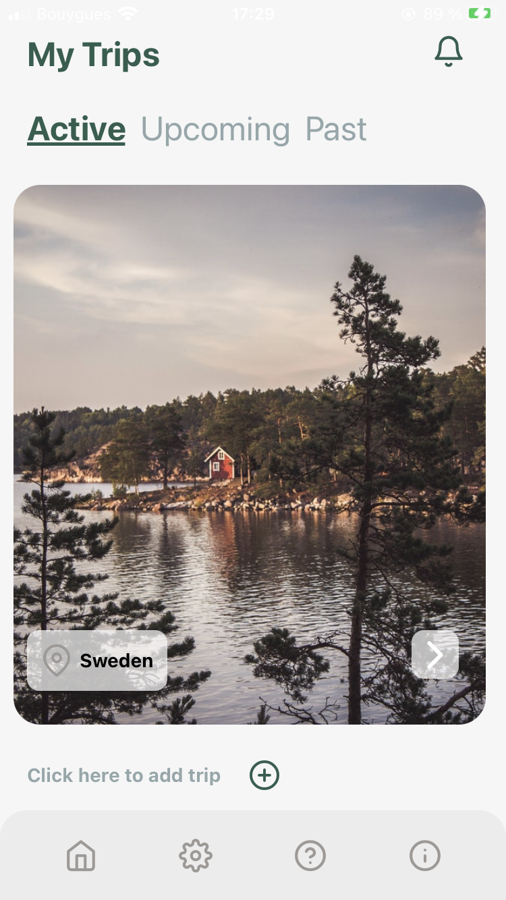
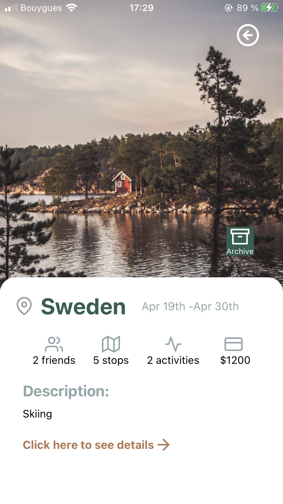

# Tripper

## Introduction

Your holidays at a glance!
Tripper is an app that allows you to plan and create trips. It centralizes all relevant trip info in a single application, for you and your friends to best plan your trips!

Users will be able to:

- Create a trip & add all necessary details (location, duration, etc..)
- Plan events & associate them to a trip
- Invite friends to a trip
- Leave async inApp posts to keep friends updated (possible inApp/email notifications)

## Tech

Tripper is a react-native-app (Expo) and its back is run with Firestore/FireBase.

Parts of the backend application is run with express.

## Wireframes/MockUps

## BackEnd

FireStore, FireBase Auth,..
